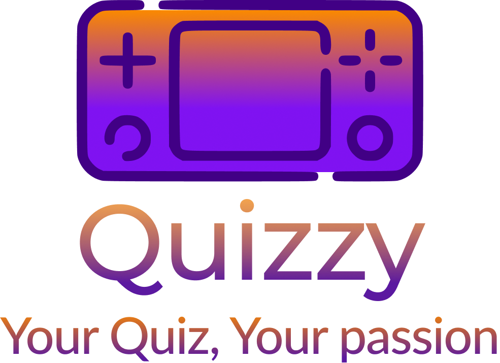

# **Quizzy**

<div style="text-align: center;">
  
</div>

##  **Project Overview**

**Quizzy** is an interactive mobile application built with **Flutter**, allowing users to **create**, **participate in**, and **customize** quizzes.  
The goal is to make learning more fun and engaging for everyone, whether with friends, colleagues, or solo.  
Quizzy lets users test their knowledge, compete, and track their progress.

**Key Features:**

- Create quizzes with customizable options  
- Participate in themed quizzes  
- Dynamic score display  
- User authentication 
- User settings and preferences  
- Modern and responsive UI

---

## **Prerequisites**

Before getting started, make sure the following tools are installed on your machine:

### Backend – Required Technologies

| Tool  | Minimum Recommended Version |
|-------|-----------------------------|
| Go    | 1.20+                       |
| MySQL | 8.0+                        |
| Redis | 6.0+                        |


### Frontend – Required Technologies

| Tool                                     | Minimum Recommended Version |
|------------------------------------------|-----------------------------|
| Flutter                                  | 3.6.1+                      |
| Dart                                     | 3.2+                        |
| Android Studio                           | Latest stable version       |
| Emulator or connected Android device     |                             |

```bash
sudo apt install -y flutter
sudo apt update
sudo apt install -y mysql-server redis-server golang git
```

---

## **How to Launch the Project**

### 1. **Clone the Backend Project (Golang)**

```bash
git clone git@github.com:QuizPassion/Backend.git
cd Backend
```

### 2. **Create the MySQL Database**

```bash
sudo service mysql start
mysql -u root -p -e "CREATE DATABASE quizzpassion_db;"
```

### 3. **Configure the `.env` File**

```bash
# Redis Configuration
REDIS_HOST=localhost
REDIS_PORT=6379
REDIS_DB=0

# Application Configuration
APP_ENV=development
APP_PORT=8080

# Database Configuration (si applicable)
DB_HOST=localhost
DB_PORT=
DB_USER=
DB_PASSWORD=
DB_NAME=

# JWT Configuration
JWT_SECRET = quizzy

# Cloudinary Configuration
CLOUDINARY_CLOUD_NAME=dxk9t394b
CLOUDINARY_API_KEY=222995554188115
CLOUDINARY_API_SECRET=fMcQlN-99RbwgXNAdsMs8Yg1w2U

# Other Configurations
MAX_IMAGE_SIZE=5242880 # Maximum image size in bytes (5 MB)
```

### 4. **Start Redis**

```bash
sudo service redis-server start
redis-cli ping
```

Expected output :

```bash
PONG
```

### 5. **Start the Go Backend**

```bash
go run main.go
```

### 6. **Clone the Frontend Project (Flutter)**

```bash
git clone git@github.com:QuizPassion/Frontend.git
cd Frontend/quizzy
```

### 7. **Install Flutter Dependencies**

```bash
flutter pub get
```

### 8. **Run the Flutter App**

```bash
flutter run
```

---

## **Packages and Dependencies Used**

### Backend (Go)

- **Gin**
- **Gorm**
- **Redis**

### Frontend (Flutter)

- **Flutter**
- **Provider**
- **HTTP**
- **Image Picker**

---

##  Customization and Development
You can customize the app by editing:

- ``api_service.dart`` for API calls (backend)
- ``main.dart`` for frontend structure

---

##  **Troubleshooting**

- **MySQL/Redis** : Make sure the services are running.
- **Flutter dependencies** : Run `flutter clean` then `flutter pub get`.
- **Backend not accessible** : Check the port and ensure the server is running.
- **Gradle (Windows)** :Ensure your ``gradle.properties`` file contains the line :
  ```properties
  org.gradle.java.home=C:/Program Files/AdoptOpenJDK/jdk-17.0.7.7-hotspot
  ```

---

## **Lancement et Test**

- Go Backend: ``localhost:<PORT>`` (default is 8080)

- Flutter Frontend: run on a connected device or emulator

---
