# Quizzy - Frontend Documentation

<div style="text-align: center;">
  
</div>

---
This document details the frontend structure of the **Quizzy** Flutter mobile application. It covers the project's folder structure, coding standards, widget usage, and asset organization.

## Project Structure

Quizzy follows the **"Folder by Feature"** architecture for clarity and scalability.

```plaintext
quizzy/
│
├── assets/                      # All static assets (fonts, images, logos)
│   ├── fonts/
│   ├── images/
│   └── logo/
│
├── lib/
│   ├── core/                    # Reusable widgets and app-wide configuration
│   │   ├── app_colors.dart
│   │   ├── app_fonts.dart
│   │   ├── app_images.dart
│   │   └── widgets/
│   │       ├── app_bar.dart
│   │       ├── nav_bar.dart
│   │       ├── background_decoration.dart
│   │       ├── confirm_exit.dart
│   │       ├── login_signup_btn.dart
│   │       ├── profile_icon.dart
│   │       ├── quizzy_scaffold.dart
│   │       ├── quizzy_text_field.dart
│   │       ├── save_button.dart
│   │       └── search_with_qr.dart
│
│   └── views/                   # Feature-based UI implementation
│       ├── create-quiz/
│       │   └── widgets/
│       │       ├── create_question_card.dart
│       │       └── created_quizz_card.dart
│
│       ├── home/
│       │   └── widgets/
│       │       ├── quiz_card_group.dart
│       │       └── quiz_card.dart
│
│       ├── in-game/
│       │   └── widgets/
│       │       ├── answer_question_card.dart
│       │       ├── answered_question_card.dart
│       │       ├── player_in_game_card.dart
│       │       └── start_game_btn.dart
│
│       └── parameters/
│           └── widgets/
│               └── parameter_card.dart
```
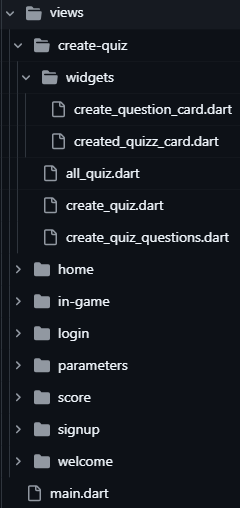

## Flutter Coding Standards

#### Widget Structure

- **Use `StatelessWidget` and `StatefulWidget` Appropriately**  
  Choose `StatelessWidget` when the widget does not manage any internal state, and `StatefulWidget` when the widget needs to manage dynamic state changes.

- **Extract Reusable UI Components into Custom Widgets**  
  Avoid code duplication by grouping frequently used UI elements or logic into separate reusable widgets.

#### Code Optimization

- **Use `const` Constructors Wherever Possible**  
  Use the `const` keyword to improve performance and reduce unnecessary rebuilds when widget trees contain static configurations.

#### Naming Conventions

- **Class Names: `UpperCamelCase`**  
  Example: `MyHomePage`, `UserProfileCard`

- **Variable and Function Names: `lowerCamelCase`**  
  Example: `userName`, `fetchUserData()`

#### Code Style

- **Default** flutter code **indentation**

## Core UI & Styling

### `app_colors.dart`
Defines consistent color constants used throughout the app for theming.

### `app_fonts.dart`
Declares font styles, sizes, and weights for a unified text appearance.

### `app_images.dart`
Holds paths to asset images for easy access and maintainability.

---

## Reusable Core Widgets

| Widget                       | Preview                             | Purpose |
|-----------------------------|-------------------------------------|---------|
| **app_bar.dart**            | 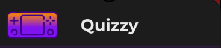 | Custom app bar widget used in multiple screens. |
| **nav_bar.dart**            | 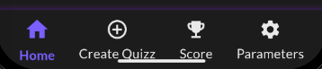 | Bottom navigation bar with app-wide navigation. |
| **background_decoration.dart** | 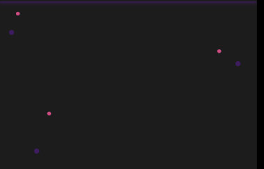 | Applies themed background decoration (e.g., gradients or images). |
| **confirm_exit.dart**       | 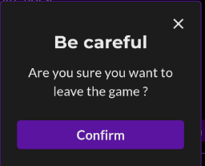 | Displays a confirmation dialog before exiting a screen or the app. |
| **login_signup_btn.dart**   | 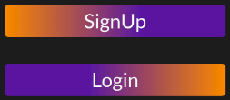 | Styled button used on login and signup screens. |
| **profile_icon.dart**       |  | Widget representing a user's avatar or profile. |
| **quizzy_scaffold.dart**    |  | Custom scaffold for consistent page layout. |
| **quizzy_text_field.dart**  | 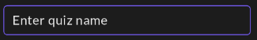 | Styled text field widget used across the app. |
| **save_button.dart**        | 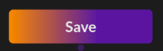 | Consistent save button used in forms or settings. |
| **search_with_qr.dart**     |  | Composite widget for searching quizzes with optional QR scanning. |

---

## Feature-Based Widgets

### `create-quiz` Feature

| Widget                     | Preview                                                                 | Purpose                                              |
|---------------------------|-------------------------------------------------------------------------|------------------------------------------------------|
| **create_question_card.dart** | 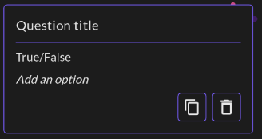 | UI card to add a new quiz question dynamically. <br>**Props:**<br>- `QuestionData data`<br>- `VoidCallback onCopy` |
| **created_quizz_card.dart**   | 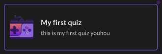   | Displays a preview or summary of a created quiz. <br>**Props:**<br>- `String quizName`<br>- `String quizDescription`<br>- `String? quizImageUrl` |

---

### `home` Feature

| Widget                  | Preview                                                           | Purpose                                                  |
|------------------------|-------------------------------------------------------------------|----------------------------------------------------------|
| **quiz_card.dart**      | 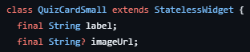      | Card widget showing a quiz’s name, thumbnail, and quick info. <br>**Props:**<br>- `String label`<br>- `String? imageUrl` |
| **quiz_card_group.dart**| 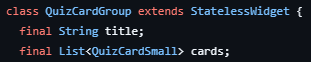| Groups quiz cards by category or filter. <br>**Props:**<br>- `String title`<br>- `List<QuizCardSmall> cards` |

---

### `in-game` Feature

| Widget                         | Preview                                                                | Purpose                                          |
|-------------------------------|------------------------------------------------------------------------|--------------------------------------------------|
| **answer_question_card.dart**   | 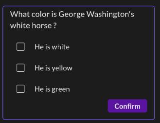   | Card that allows a player to select their answer. <br>**Props:**<br>- `VoidCallback onConfirm` |
| **answered_question_card.dart**| 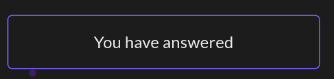 | Shows the answer and whether it was correct. |
| **player_in_game_card.dart**   | 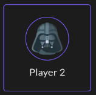   | Displays a player's score and progress in a game. <br>**Props:**<br>- `String playerName` |
| **start_game_btn.dart**        |         | Button to begin the quiz game. <br>**Props:**<br>- `VoidCallback onPressed`<br>- `String text` |

---

### `parameters` Feature

| Widget              | Preview                                                             | Purpose                                           |
|--------------------|---------------------------------------------------------------------|---------------------------------------------------|
| **parameter_card.dart** | 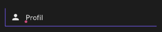 | Displays and allows modification of app/user settings. <br>**Props:**<br>- `IconData icon`<br>- `String text`<br>- `VoidCallback onTap` |

---

## Assets

### Fonts
Custom fonts are stored in `assets/fonts/` and declared in `pubspec.yaml`.

### Images
All image files (e.g., icons, quiz thumbnails) are in `assets/images/`.

### Logos
App logos and branding visuals are in `assets/logo/`.

---

## Notes

- This app follows **clean UI principles** with emphasis on component reusability and separation of concerns.
- The **Folder by Feature** structure improves maintainability and helps scale the app by keeping logic and widgets localized.
